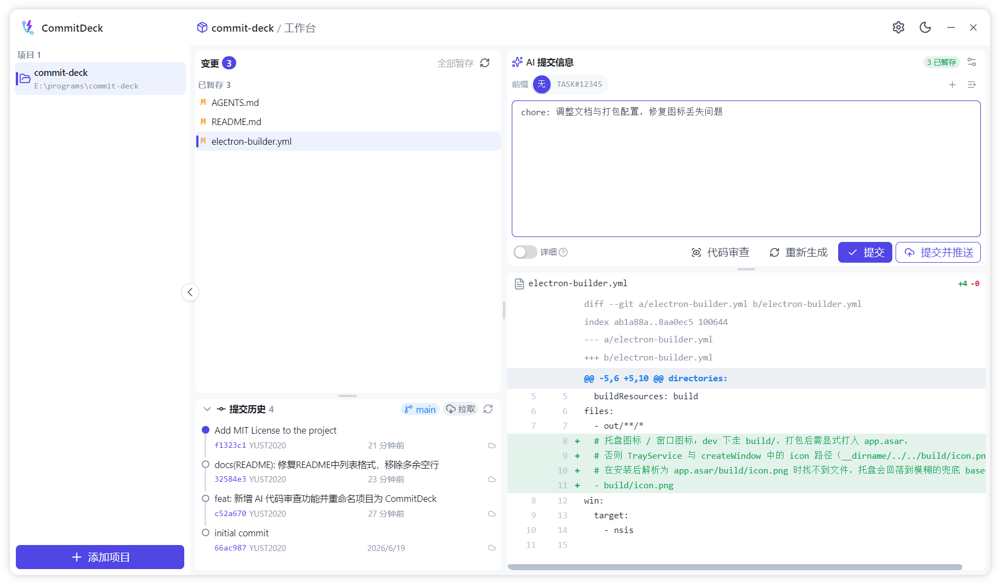

<div align="center">
  
  <h1>CommitDeck</h1>
  <p><b>AI 驱动的本地 Git 提交助手 · Commit Message 生成 & Code Review</b></p>

  <p align="center">
    
    
    
    
  </p>

  
</div>


## ✨ 核心特性

### 🚀 Commit Message 生成
 **流式生成**：一键分析暂存区 Diff，流式输出符合 Conventional Commits 规范的提交信息。
 **自定义前缀**：支持维护项目专属的前缀列表，按需快速选择。
 **规则引擎**：自由编辑 AI 生成规则，完美适配团队规范。
 **智能截断**：自动折叠大文件、二进制文件，在模型上下文预算内智能截断 Diff。
 **一键操作**：确认后支持直接 Commit 或 Commit + Push。

### 🔍 AI Code Review
- **按需评审**：独立评审通道，可挑选特定变更文件进行针对性评审。
- **结构化报告**：Markdown 格式报告，包含总体评价及 `🔴 严重` / `🟡 建议` / `🔵 可选` 三级反馈。
- **便捷交互**：支持一键重试与复制评审结果。

### 📦 本地优先 & 多项目管理
- **系统集成**：所有 Git 操作均在本地执行，复用系统 SSH 与 Git Credential Manager。
- **多项目并行**：侧边栏快速切换不同仓库，独立配置每个项目的 AI 偏好。
- **智能同步**：Pull / Push 自动处理 rebase，冲突时自动保护工作区。
- **极致体验**：支持全局快捷键唤起（默认 `Alt+Shift+G`）、系统托盘、开机自启。

---

## ⚖️ 为什么选择 CommitDeck？

Cursor、Trae 等 IDE 自带 AI 能力，但仍有很多不足：

| 痛点场景 | 通用 AI 编程工具 | CommitDeck |
| :--- | :--- | :--- |
| **提交前缀不可控** | 仅遵循固定规范，难以根据公司规范快速生成关联前缀（如 `TASK#123`，`BUGFIX#123`） | **完全自定义**，支持按项目记忆前缀列表 |
| **生成规则不可改** | 规则内置，无法适配特定团队规范 | **规则全开放**，支持自由定义 Prompt |
| **模型选择受限** | 绑定厂商模型，无法切换或私有部署 | **协议全兼容**，支持 GLM / DeepSeek 及任意 OpenAI 端点 |
| **独立 GUI 缺失** | 必须在 IDE 内操作，缺少独立管理界面 | **独立桌面端**，支持全局快捷键与多项目管理 |

---

## 🤖 AI 模型配置

支持在「设置 → AI 服务」中灵活配置：

- **智谱 GLM**：预设 BigModel 端点，推荐 `glm-4-flash`。
- **DeepSeek**：支持 OpenAI / Anthropic 双协议，推荐 `deepseek-chat`。
- **自定义端点**：支持任意兼容 OpenAI / Anthropic 协议的服务（含私有部署）。

---

## 🛠️ 本地开发

**环境要求**
- Node.js ≥ 18
- pnpm (推荐)

```bash
# 克隆仓库
git clone https://github.com/<your-username>/commit-deck.git
cd commit-deck

# 安装依赖
pnpm install

# 启动开发环境
pnpm dev

# 构建安装包
pnpm build:win    # Windows
pnpm build:mac    # macOS
pnpm build:linux  # Linux
```

---

## 🗺️ Roadmap

- [x] AI Commit Message 流式生成
- [x] 自定义前缀 / 规则 / 模型端点
- [x] AI Code Review 结构化报告
- [x] 多项目管理与基础 Git 操作
- [ ] 代码冲突图形化合并引导
- [ ] 更多 AI 提效工具扩展

---

## 📄 许可证

本项目采用 [MIT License](LICENSE) 许可协议。
